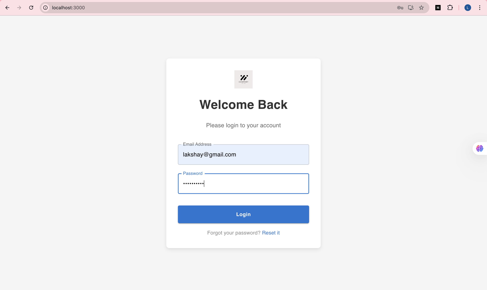
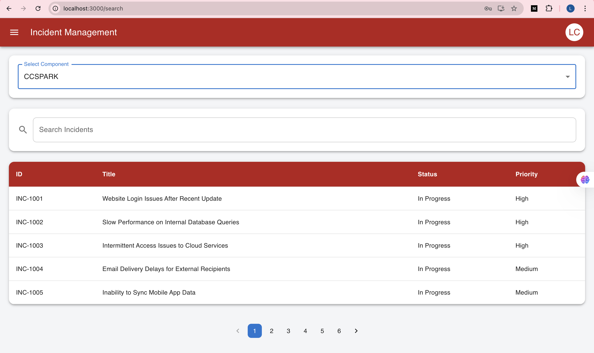
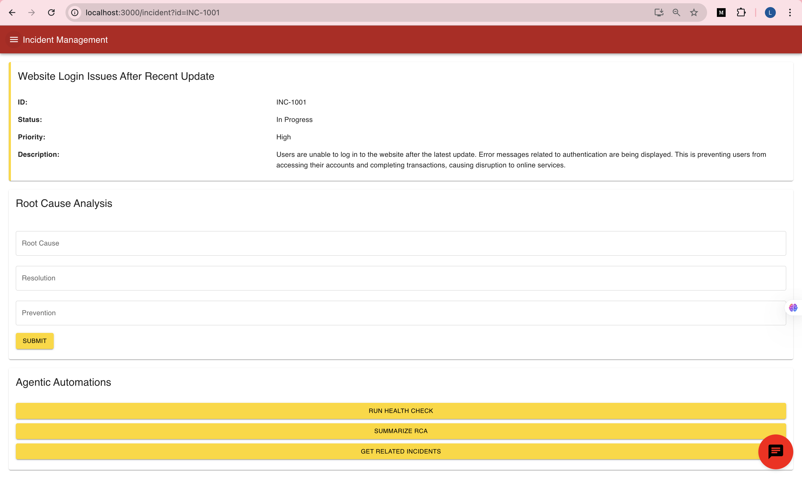
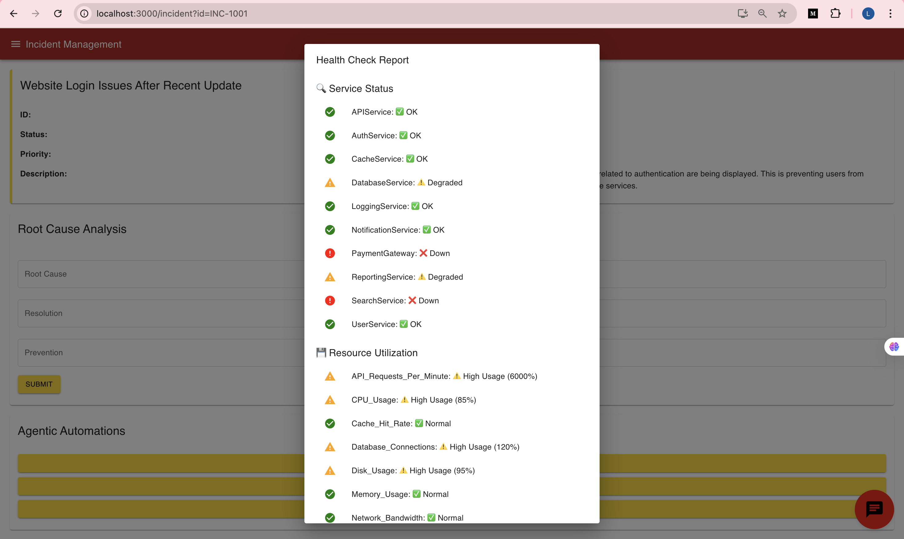
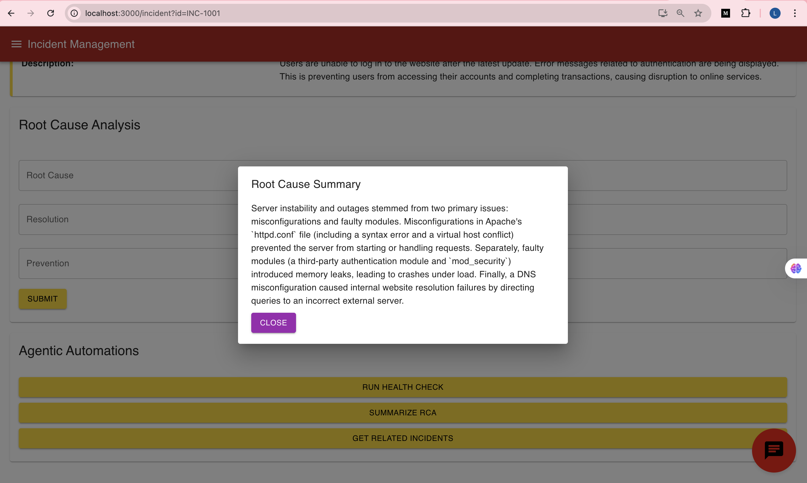
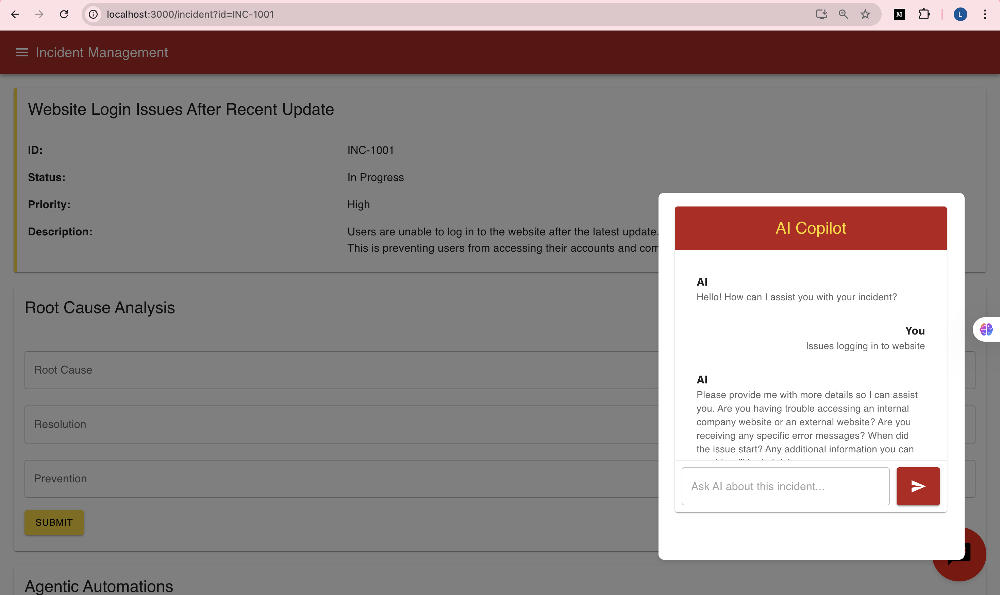
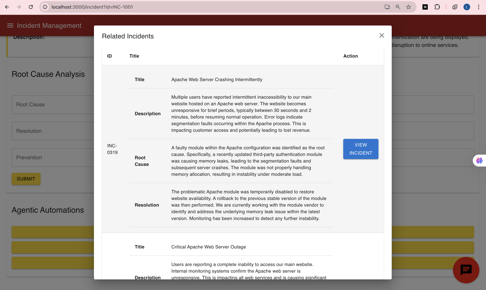
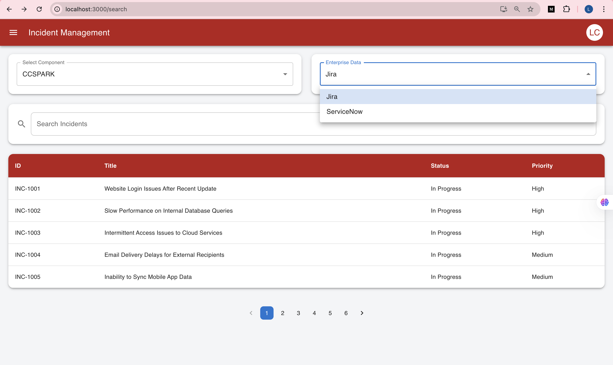

# 🚀 GEN AI For Platform Support - Integrated Platform Environment

## 📌 Table of Contents
- [Introduction](#introduction)
- [Demo](#demo)
- [Inspiration](#inspiration)
- [What It Does](#what-it-does)
- [How We Built It](#how-we-built-it)
- [Challenges We Faced](#challenges-we-faced)
- [How to Run](#how-to-run)
- [Tech Stack](#tech-stack)
- [Team](#team)

---

## 🎯 Introduction
Our project is a GEN AI-based platform designed to empower support engineers with advanced agentic capabilities. It streamlines root cause analysis, generates health check reports, and retrieves incidents related to the issue being resolved. The platform features an AI chatbot that enables users to dive deeper into the current problem, fetch related incidents for detailed analysis, and summarize root cause analyses with a single click. Leveraging contextual recommendations, the AI chatbot ensures precise and relevant responses, enhancing the efficiency of issue resolution.

## 🎥 Demo

🖼️ [Slides](artifacts/demo/Hackathon_OpsIntellect.pptx)

📹 [Video Demo](#) (if applicable)

🖼️ Screenshots:

**Login Page**:


**Search Incidents Page**:


**Integrated Platform Console**:


**Health Check**:


**Summarize RCA**:


**AI Chatbot**:


**Pull related Incidents**:


**MCP Protocol**:


## 💡 Inspiration
The idea for this project came from seeing how platform engineers struggle with using many dashboards to handle incidents and requests. This scattered way of working slows things down, causes mistakes, and makes the job harder. We wanted to create a simple tool using generative AI to bring all the data together, give helpful insights, and handle repetitive tasks. This way, engineers can focus on solving problems faster and better.

## ⚙️ What It Does
Our GEN AI-based platform is here to transform how platform support engineers tackle incidents and uncover root causes. Here's what makes it stand out:

### **Key Features**

- **AI Chatbot with Contextual Understanding**  
   - Chat with an AI that understands your issue and gives helpful answers.  
   - Uses past incidents to provide accurate and relevant suggestions.  
   - Helps you explore the problem deeper with smart recommendations.

- **Summarize RCA Button**  
   - Create a quick and clear summary of the root cause analysis (RCA) with one click.  
   - Ensures all reports are consistent and easy to understand.

- **Pull Related Incidents Button**  
   - Find past incidents similar to the current issue instantly.  
   - Spot patterns or recurring problems by analyzing historical data.  
   - Makes it easier to decide what to do next without searching manually.

- **Health Check Reports**  
   - Get a snapshot of how the system is doing (mocked for now).  
   - Spot potential issues early and fix them before they become big problems.  
   - Keeps the platform stable and reliable with proactive checks.

### **How It All Works Together**  
These features work as a team to make solving problems faster and easier. The AI gives smart suggestions, reports are automated, and data is at your fingertips. This means less manual work and more time to focus on fixing issues.

## 🛠️ How We Built It

- First we created a dataset of mock incidents as per the requirement of the problem statement.
- We created a vector DB for these incidents using Chroma DB. This is a vector DB that stores closed incidents in vector format. We converted the strings into vector format using Gemini embedding model.
- We have created a backend using flask to call different functions written in python.
- We have created a frontend page using react and integrated with the backend.
- To implement pull related incidents feature, we have performed a similarity check of the user's current query against the vectors in Chroma DB and returned the top_k = 5 ones.
- To implement summarise RCAs feature, we have pulled the related incidents and asked Gemini to summarise it using a prompt.
- To perform health check for a component we can get the logs from splunk, check system stats like cpu usage, ram usage etc. from builtin commands. Since we do not have access to it, we have mocked the health check data variables and created the report.
- To create the chatbot, we have leveraged Gemini and provided it context of the user's query and the current incident being resolved. It will retrieve related incidents from the chroma DB to generate a more precise response.

## 🚧 Challenges We Faced

- Creating the dataset for the required problem statement.
- Understanding the problem statement from the lens of a support engineer.
- Ensuring the AI chatbot provides accurate and contextually relevant responses.
- Implementing the vector similarity search for related incidents efficiently.
- Mocking health check data in the absence of real-time system access.
- Debugging and resolving cross-origin issues during frontend-backend communication.
- Balancing feature implementation with time constraints during the hackathon.
- Testing and validating the platform's functionality with limited resources.
- Designing a user-friendly interface that aligns with the needs of support engineers.
- Managing dependencies and ensuring compatibility across different environments.

## 🏃 How to Run
1. Clone the repository  
   ```sh
   git clone https://github.com/ewfx/gaipl-ops-intellect.git
   ```
2. Install dependencies  

   **Frontend Setup**
   ```sh
   cd code/src/frontend
   npm install # Install dependencies
   ```

   **Backend Setup**

   Before setting up the backend, we need an Gemini API key.

   After getting the Gemini API Key, run `encrypt.py` file by passing your api key. Now put this encrypted key in `creds.json` as the value for `api_key

   ```sh
   cd code/src/backend # Move to root folder of the repo and then run this command
   python3 -m venv env # Setting up virtual environment for python. Make sure python is of version 3.13
   source env/bin/activate
   pip install -r requirements.txt # Install dependencies
   python3 setup_chroma.py # Generate chromaDB
   ```
3. Run the project 

   **Backend Setup**
   ```sh
   cd code/src/backend # Move to root folder of the repo and then run this command
   flask run
   ```
   Backend runs on `http://localhost:5000`

   **Frontend Setup**
   ```sh
   cd code/src/frontend
   npm start
   ```
   Frontend runs on `http://localhost:3000`

   We have not implemented login functionality, so you can enter any string that has valid **email format** and password to go to the next page. 

## 🏗️ Tech Stack
- 🔹 Frontend: React
- 🔹 Backend: Flask
- 🔹 Database: Mock database but can be integrated with Mongo DB
- 🔹 Other: Gemini API, langchain

## 👥 Team
- **Venneti Sri Satya Vinay** - [GitHub](https://github.com/srisatyavinay) | [LinkedIn](https://www.linkedin.com/in/srisatyavinay)
- **Lakshay Chandra** - [GitHub](https://github.com/Lakshayy28) | [LinkedIn](https://www.linkedin.com/in/lakshay-chandra28/)
- **Aishwarya Arunachalam** - [GitHub](https://github.com/Aishwarya1221)
- **Aryan Yadav** - [GitHub](https://github.com/Aryany871)
